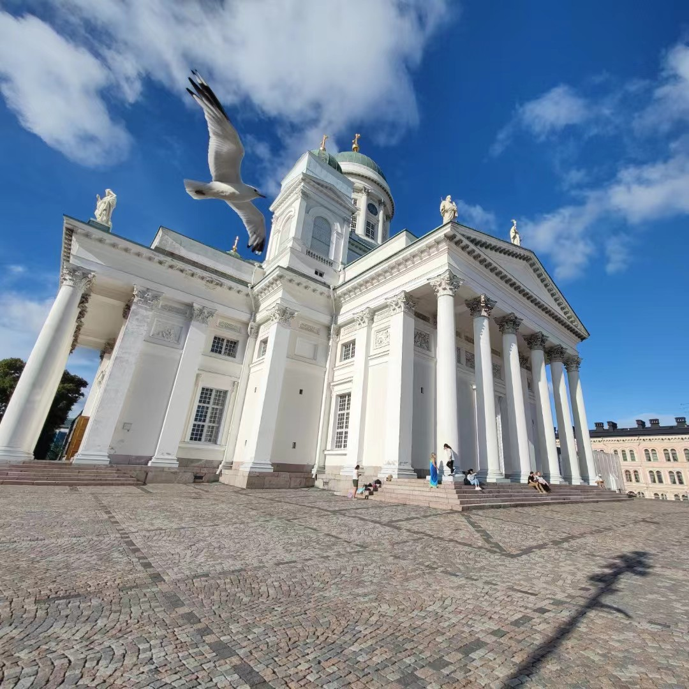
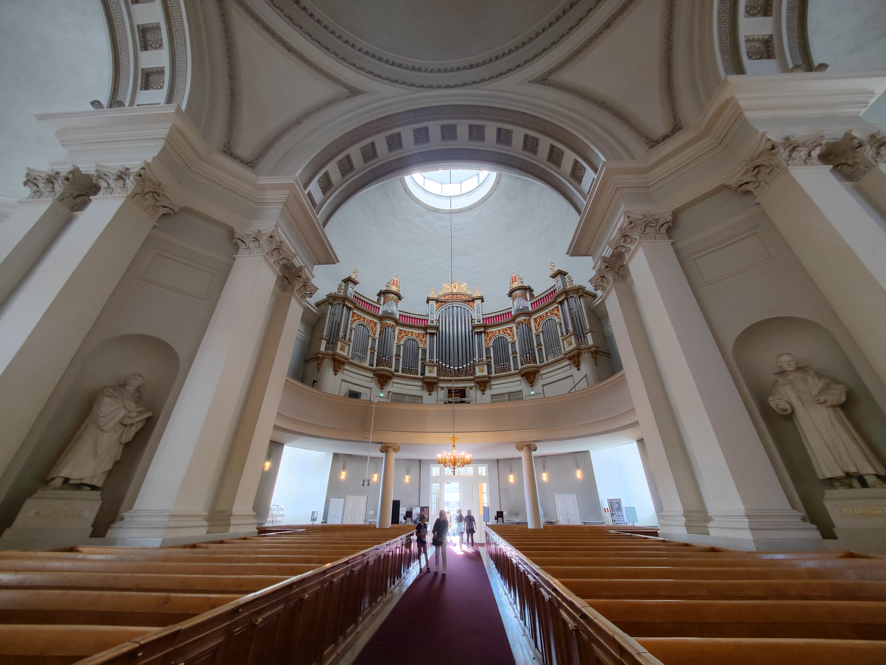
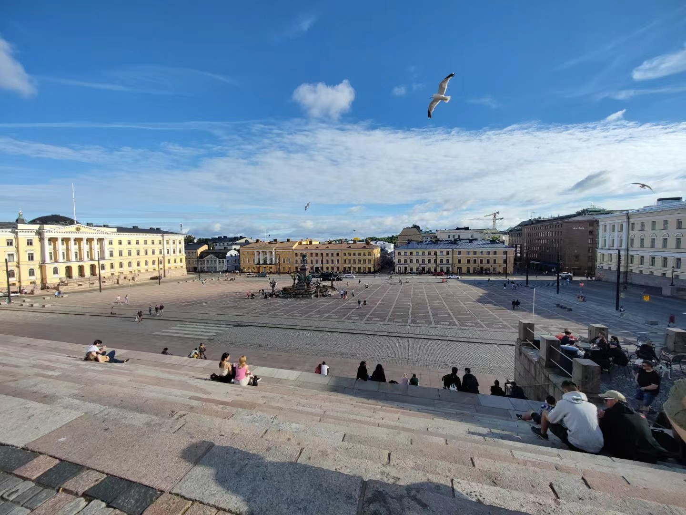
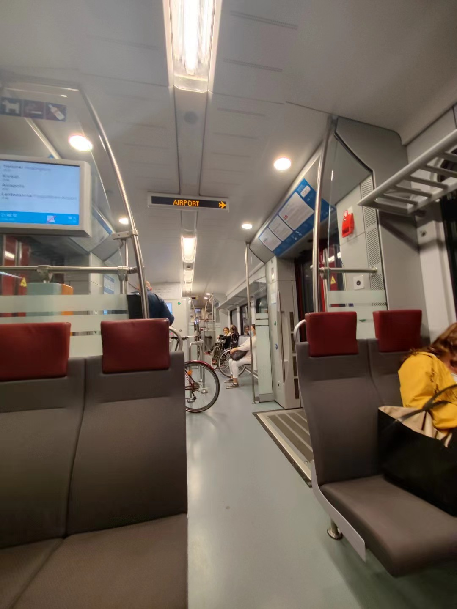
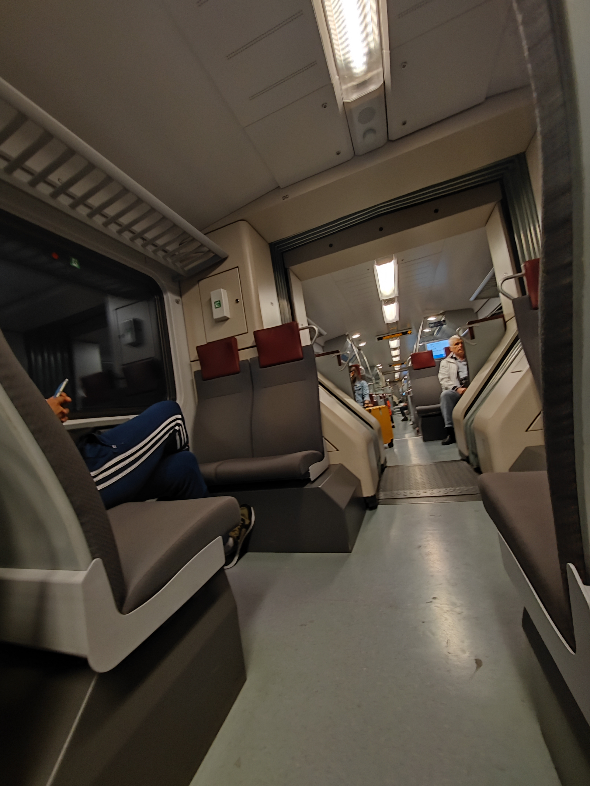
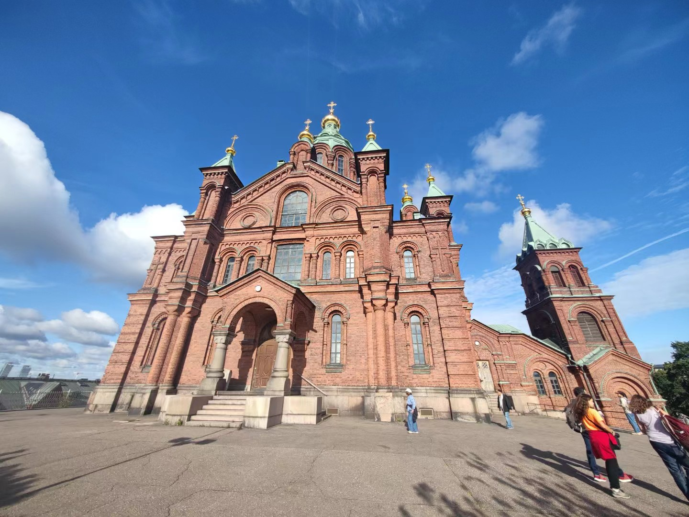
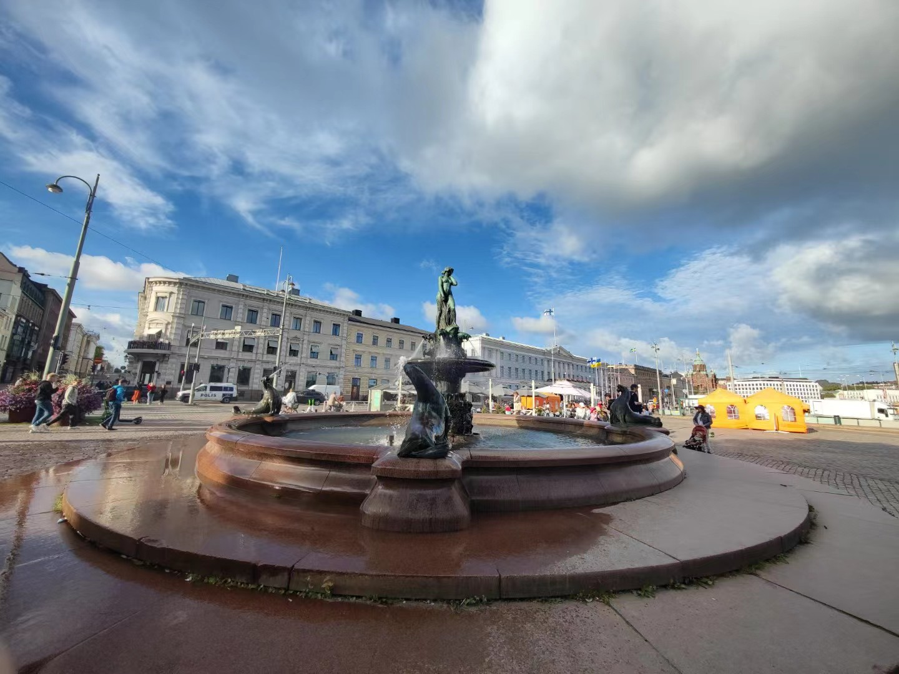

笔者从冰岛返回新加坡途中中转芬兰 赫尔辛基机场，由于中转时间过长，趁机参观了芬兰首都 -- [赫尔辛基](https://zh.wikipedia.org/zh-sg/%E8%B5%AB%E5%B0%94%E8%BE%9B%E5%9F%BA)。

> “Let's continue our journey in Finland ! ”

## 

##

##

##

##

##

##

##

##

##

##

##

##

##

##

##

